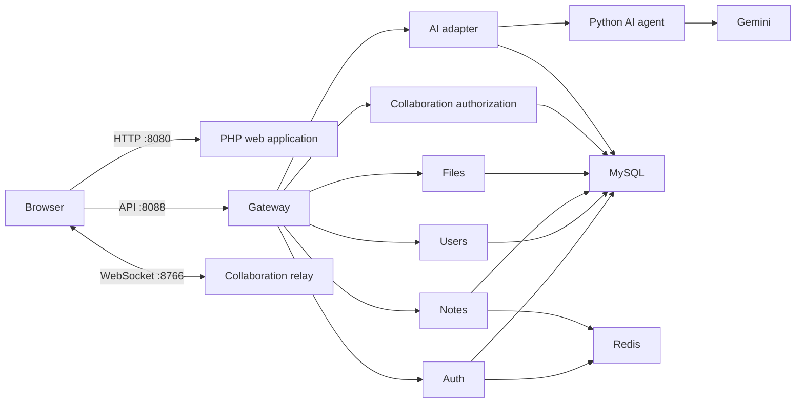

# Notezy service architecture

## Running topology



## Service contracts and ownership

| Service | Public route through Gateway | Owns | Runtime responsibility |
|---|---|---|---|
| Auth | `/api/auth/*` | identity tokens | login, registration, short-lived bearer token, Redis login throttling |
| Users | `/api/users/*` | profile and preferences | current-user profile only |
| Notes | `/api/notes/*` | notes, labels, pins | CRUD, search, label filter, 30-second Redis cache with version invalidation |
| Files | `/api/files/*` | attachment bytes | authorization, MIME/size validation, isolated uploads volume |
| Collaboration | `/api/collaboration/*` | room authorization, presence | short-lived signed WS tokens; the relay transports frames only |
| AI | `/api/ai/*` | AI boundary | bearer authorization and safe proxy to the Python orchestration agent |
| Premium | `/api/premium/*` | entitlement checks | plan and daily usage decision |

The Gateway alone is published externally for service APIs. Internal PHP
services and Redis have no host port. Every Gateway request receives and
forwards `X-Request-Id`, so an API request can be followed in service logs.

## Data migration boundary

The current Docker demo intentionally uses one MySQL server to remain simple
for classroom deployment. Tables are nevertheless owned by one service as
listed above; services do not accept a caller-provided `user_id` and derive it
from a signed bearer token.

For a production split, move the owned tables into separate schemas/databases
in this order without changing the Browser API:

1. `auth` and `users` first, exposing profile lookup as an internal API.
2. `notes` and `files`, replacing foreign-key joins with service calls or
   immutable user/note references.
3. `collaboration` and `premium`, which then consume events instead of joining
   note and subscription tables.
4. Add an outbox table and publish `note.created`, `note.updated`,
   `attachment.created`, and `subscription.changed` events through Redis
   Streams or a dedicated broker.

This keeps today’s working demo operational while documenting a safe path to
true database-per-service ownership.

## Local command

```powershell
docker compose -f docker-compose.yml -f docker-compose.services.yml --profile tools up -d --build
```

## Production deployment contract

Use the production overlay so containers run the images that were built for
the release rather than files mounted from a developer machine:

```powershell
docker compose -f docker-compose.yml -f docker-compose.services.yml -f docker-compose.production.yml --profile tools up -d --build
```

Before deploying, set unique values for `DB_PASSWORD`,
`SERVICE_DB_PASSWORD`, `JWT_SECRET`, and `AI_AGENT_SHARED_SECRET` in the
deployment secret store. `SERVICE_DB_PASSWORD` is intentionally separate from
the MySQL root password. The `db_provisioner` applies the idempotent base,
account, premium, and outbox migrations on every release before application
services start.

Only the browser application is intended to face the public internet. Place a
TLS reverse proxy in front of it; the Gateway and collaboration relay are
bound to loopback, and the AI agent has no host port in this overlay.
